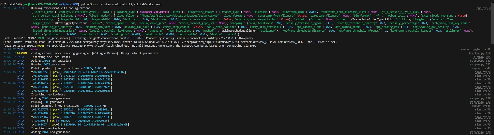

<div align="center">
<h1>测试 Splat-LOAM: Gaussian Splatting LiDAR Odometry and Mapping</h1>
</div>


## 配置测试

* 可以采用作者提供的Docker或者Pixi，不过此处采用conda

```sh
git clone --recursive https://github.com/R-C-Group/Splat-LOAM.git

# rm -rf .git

conda env create -f environment.yaml # for A100 with CUDA12.2
# # conda remove --name Splat-LOAM --all
conda activate Splat-LOAM
# bash post_install.sh

# 安装第一个模块
pip install ./submodules/diff-surfel-spherical-rasterization/

# 安装第二个模块
pip install ./submodules/gsaligner/

# 安装第三个模块
pip install ./submodules/simple-knn/
```

* `configs`文件中含有运行所需要的配置
* 运行代码（注意要修改数据的路径,同时下载[kitti](https://www.cvlibs.net/datasets/kitti/eval_odometry.php)数据）

```sh
python3 run.py slam <path/to/config.yaml>

conda activate Splat-LOAM
python3 run.py slam configs/kitti/kitti-00-odom.yaml
```

* 注意，上述需要在`sequences/00`内还要有times.txt文件，故此需要下载图像帧看看
* 若`output.folder`没有设置，实验结果会保存在 `results/<date_of_the_experiment>/`文件中
* 运行后提醒打开浏览器`http://127.0.0.1:9876/`,但是加载好久都加载不出来（可能是远程服务器网络不行吧）

<div align="center">
  
<figcaption>  
</figcaption>
</div>

>[!TIP]
>If you want to solve `Mapping-only`, provide a trajectory in `data.trajectory_reader.filename`, set tracking to use it with `tracking.method=gt` and enable skipping of clouds that have no associated pose with `data.skip_clouds_wno_sync=true`


* 运行完SLAM后，可以生成mesh

```sh
python3 run.py mesh <path/to/result/folder>
```

* 3D Reconstruction

```sh
python3 run.py eval_recon <reference_pointcloud_file> <estimate_mesh> 
```